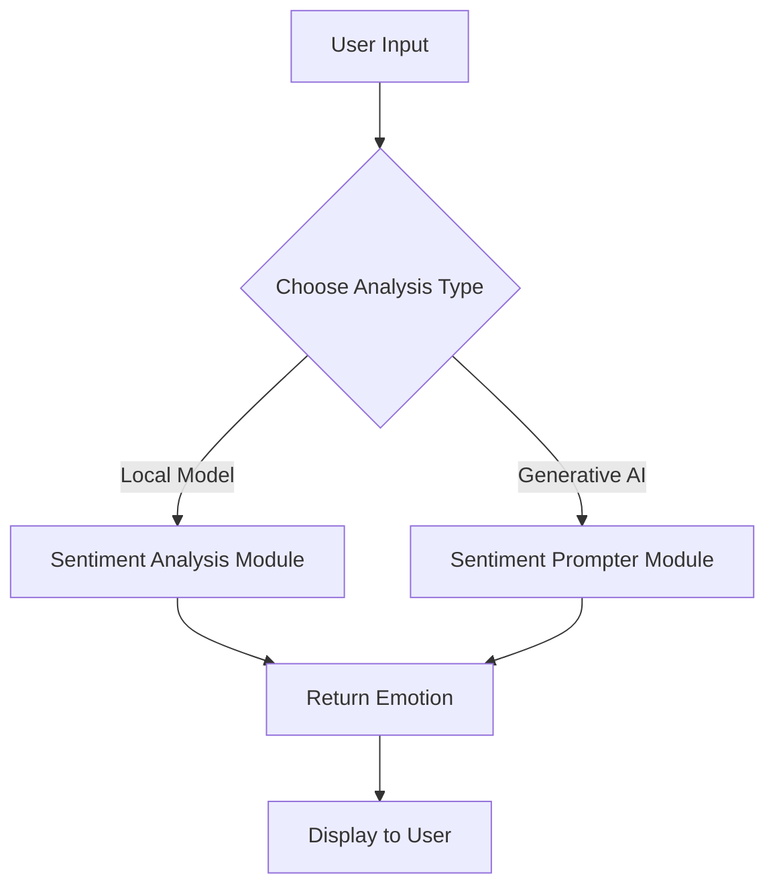

# 🌈 MoodBot – Emotionally Intelligent Assistant

## 📌 Overview
**MoodBot** is a smart sentiment analysis assistant that detects the underlying emotion in text using both traditional machine learning and the power of **Google Generative AI (Gemini)**. Whether you're building empathetic chatbots or analyzing customer feedback, MoodBot offers emotionally intelligent insights with just a few lines of text.

---

## 🧭 How It Works

1. **User Input**: MoodBot prompts you to enter a sentence or phrase.
2. **Choose Analysis Mode**:
   - ✅ Local ML model (`sentiment_analysis.py`)
   - ☁️ Google Generative AI (`sentiment_prompter.py`)
3. **Sentiment Prediction**: The app returns the emotion label — *joy*, *anger*, *sadness*, *fear*, *love*, or *surprise*.
4. **Result Displayed**: You get immediate feedback on the emotional tone of the input.

---

## 🔁 Pipeline and Flow



---

## 🧩 Module Descriptions

### `server.py` – App Controller
This is the main script that ties everything together. It takes user input, determines which method to use (traditional ML or GenAI), and prints out the result.

**Key Method:**
- `main()`: CLI loop to get text input and call the sentiment detection function.

---

### `sentiment_analysis.py` – ML-based Sentiment Detection
Uses Hugging Face's transformer models (e.g., BERT) trained on the **Emotion Dataset** to classify emotion.

**Key Methods:**
- `load_model()`: Loads a pre-trained sentiment classifier.
- `analyze_sentiment(text: str) -> str`: Returns predicted emotion using the model.

---

### `sentiment_prompter.py` – Google GenAI Sentiment Detector
Uses **Google Generative AI** (Gemini) to perform zero-shot sentiment analysis through prompt engineering.

**Key Methods:**
- `setup_model()`: Authenticates using your API key and initializes the Gemini model.
- `generate_prompt(text: str) -> str`: Crafts a custom prompt to guide Gemini’s response.
- `get_sentiment(text: str) -> str`: Sends the prompt to Gemini and extracts the emotion from its response.

---

## 📚 Dataset

We trained and validated MoodBot using the [**Emotion Dataset**](https://www.kaggle.com/datasets/praveengovi/emotions-dataset-for-nlp) from Kaggle.

**Features:**
- ~20K labeled text samples
- 6 emotion classes: `joy`, `anger`, `sadness`, `fear`, `love`, `surprise`
- Format: CSV with columns `text` and `label`

---

## 📦 Requirements

Install dependencies using the `requirements.txt` file:

```txt
google-generativeai>=0.3.1
protobuf>=4.21.0
google-auth>=2.6.0
requests>=2.28.1
transformers>=4.36.0
torch>=2.0.0
nltk>=3.8.1
```
